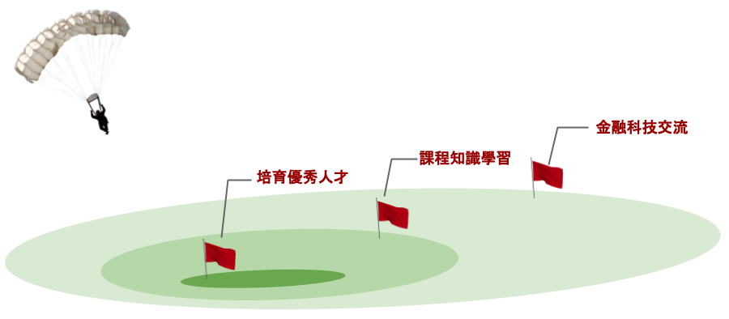

> 🛠️ 頁面仍在建置中，歡迎填寫 [EMail (Google 表單)](https://forms.gle/3aQbEWZ1iAtHmhm79)，每個月 5 號得到最新消息 🛠️

[Facebook 粉絲專頁](https://www.facebook.com/OwlsAboutFintech)    /    [Facebook 社團](https://www.facebook.com/groups/840713936495332)    /    [Instagram](https://www.instagram.com/owlsaboutfintech/)

## 最新消息 

建置中

## 願景與目標

- 訓練課程
- 培育計畫

## 訓練課程 Curriculums

建置中

#### 金融科技基礎 Basic  

1. 大數據分析
2. 人工智慧
3. 區塊鏈技術
4. 網路與資訊安全
5. 雲端運算

#### 特色教學 Featured

1. 全球宏觀思維
2. 量化交易思維

##### 全球宏觀思維 Macro Thinking

1. 債市解讀
2. 金融創新與危機
3. 中國金融市場
4. 宏觀分析原理

##### 量化交易思維 Quant Thinking

1. 量化交易管理
2. 自適應交易系統開發
3. 金融市場原理

#### 金融科技實作課程 FinTech Advanced

1. 演算法交易平台
2. 並行程式設計

## 培育計畫 (Priming Program, PP)

建置中

### PP Player

- 簡介   
- 目標  
- 報名
- 資格
- 流程

### PP Asia

- 簡介   
- 目標  
- 報名
- 資格
- 流程

### PP Global

- 簡介   
- 目標  
- 報名
- 資格
- 流程

### 關於 Ricky

我現在想要開始幫美國與歐洲的 FinTech 公司找人

把人推出去。但這個人需要至少是我的水準或更高

所以我會訓練人，但不綁人

我只是要確定我推出去的人有一定的能力

可能為他人用、為我用

當然我不一定是對的

所以每個人可以自己撿他想參與培訓的程度

所以我開了一個 [臉書社團](https://www.facebook.com/groups/840713936495332)

未來我的小編會幫我弄全套 Social Media

我只是想要對我推出去的人要能驗證，這不是大生意

我只是想讓自己成為一個值得信任的管道

但是這個管道的副作用就是 (1) 訓練機會與 (2) 知識學習

我會在這邊分享這些東西